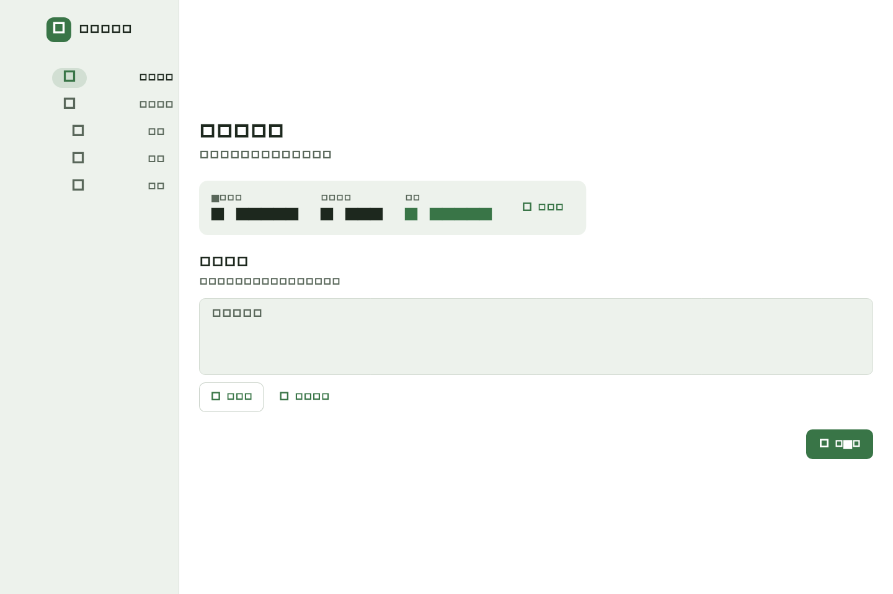
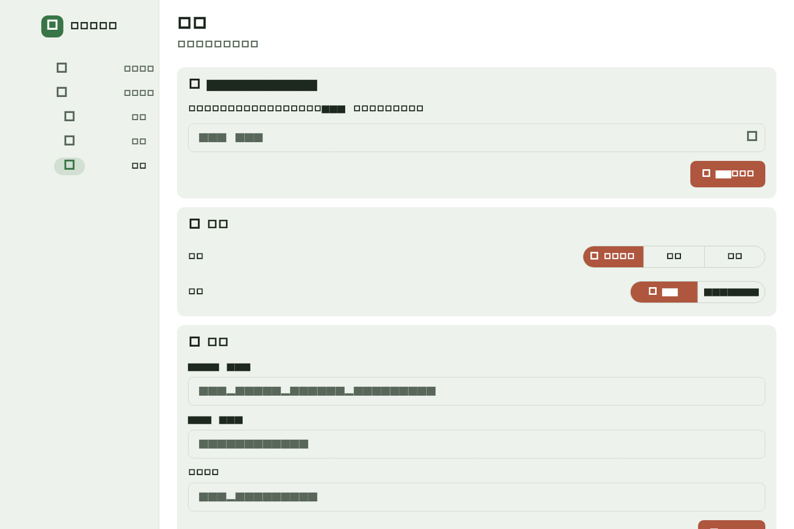
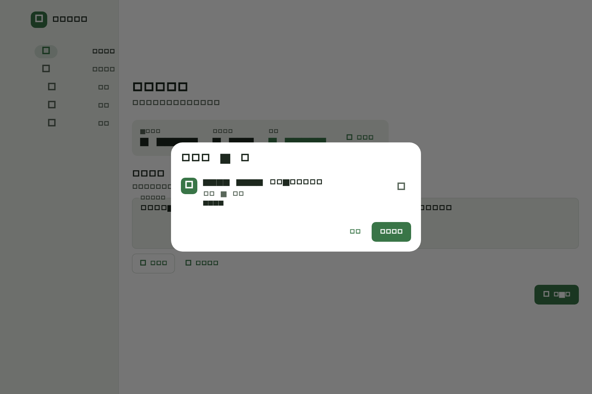

# 购物守护者

购物守护者是一个本地运行的小工具，用来整理购物车和商品分享链接。你可以把淘宝、天猫或京东的分享文字贴进来，也可以直接选择购物车截图。应用会先整理出商品，再交给你自己的模型服务做消费分析。

项目不提供在线账号和中转服务器。商品、设置和记录都留在本机，模型与商品接口的费用由用户自己的 API Key 承担。

> 当前是早期测试版，先支持 macOS。Android 和 iOS 会沿用同一套 Flutter 代码继续适配。



## 已经能做什么

- 解析京东购物清单分享链接
- 解析京东单商品短链和商品链接
- 解析淘宝、天猫单商品分享链接
- 从淘宝、天猫、京东购物车截图中识别商品
- 使用 JustOneAPI 补充商品标题、价格和图片
- 在导入前预览并核对识别结果
- 切换浅色、深色、跟随系统主题
- 切换中文和英文

淘宝购物车分享链接并不总能在淘宝 App 之外打开，所以截图导入是目前最稳妥的办法。京东既支持购物清单链接，也支持截图。

## 安装 macOS 测试版

1. 打开仓库右侧的 **Releases**。
2. 下载名称类似 `shopping-guardian-macos-v0.1.0.zip` 的文件。
3. 解压后，把“购物守护者”拖到“应用程序”文件夹。
4. 双击打开。

当前测试包还没有 Apple Developer ID 签名和公证。如果 macOS 拦截启动，可以在 Finder 中右键应用，选择“打开”，再确认一次。也可以前往“系统设置 → 隐私与安全性”，在底部允许打开。

## 第一次使用

### 1. 配置 JustOneAPI

进入“设置”，在 JustOneAPI 区域填写自己的 API Key，然后点击“测试并保存”。测试成功后，Key 才会写入本机。



JustOneAPI 用来查询淘宝和京东的商品详情。没有配置 Key 时，京东购物清单仍可以读取页面上已有的标题和价格，但淘宝单商品、京东单商品的详情补全会受到限制。

macOS 测试版把 Key 保存到当前用户的应用数据目录，并设置为仅当前用户可读。Android 和 iOS 版本将使用系统安全存储。Key 不会写入项目源码，也不会进入数据导出文件。

### 2. 用分享链接导入

1. 在淘宝、天猫或京东 App 中选择“分享”或“复制链接”。
2. 把完整分享文字粘贴到首页的“链接或描述”。
3. 点击“下一步”。
4. 检查应用识别出的商品标题、价格和数量。
5. 确认无误后继续填写预算和购买理由。

支持一次粘贴多条分享文字。京东购物清单会自动展开成多件商品。



### 3. 用购物车截图导入

1. 在淘宝、天猫或京东购物车中截图。
2. 尽量让商品标题、价格和数量完整出现在画面里。
3. 回到购物守护者，点击“选截图”。
4. 选择 PNG、JPEG 或 HEIC 图片。
5. 在预览页检查识别结果。

macOS 使用系统自带的 Vision OCR，识别过程在本机完成，不要求模型支持图片。长购物车可以分成多张截图导入。截图中如果有失效商品、广告或复杂促销，最好在预览页手动核对。

## 支持情况

| 输入方式 | 淘宝 / 天猫 | 京东 |
| --- | --- | --- |
| 单商品分享链接 | 支持 | 支持 |
| 购物车 / 清单分享链接 | 尽力解析，可能受淘宝登录和风控限制 | 支持 |
| 购物车截图 | 支持 | 支持 |
| 商品详情补全 | 需要 JustOneAPI | 需要 JustOneAPI |

## 已知限制

- 淘宝购物车分享页可能只允许淘宝 App 打开，无法保证每条链接都能自动解析。
- 截图 OCR 会受字体、图片清晰度和商品排版影响，识别后需要人工确认。
- 当前消费分析和本地历史记录仍在开发中，现阶段重点是把商品可靠地导入。
- macOS 测试包尚未签名和公证。
- Android 和 iOS 还没有可安装包。

## 从源码运行

需要 Flutter 3.44 或更新版本，以及完整安装的 Xcode。

```bash
flutter pub get
flutter run -d macos
```

运行检查：

```bash
dart analyze lib test integration_test tool
flutter test
flutter build macos --release
```

macOS Release 产物位于：

```text
build/macos/Build/Products/Release/购物守护者.app
```

## 项目文档

- [MRD](购物守护者-MRD-v0.2.md)
- [PRD](购物守护者-PRD-v0.1-macOS.md)
- [产品上下文](PRODUCT.md)
- [设计规范](DESIGN.md)

## 隐私

- 不需要注册账号
- 不上传购物车截图
- 不提供模型或商品接口中转服务
- API Key 不会提交到 Git
- 模型请求直接发送到用户填写的服务地址

## License

Apache License 2.0
