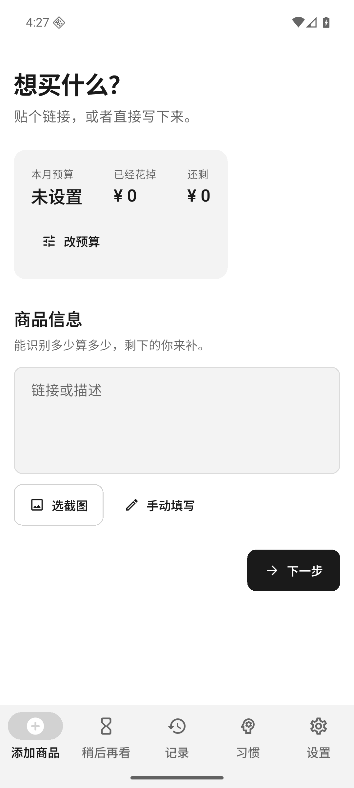
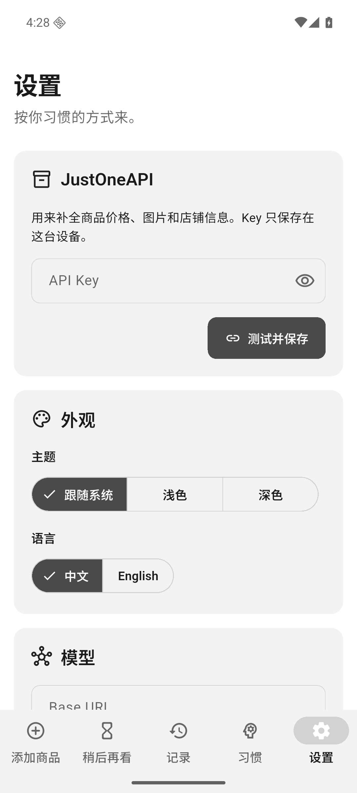
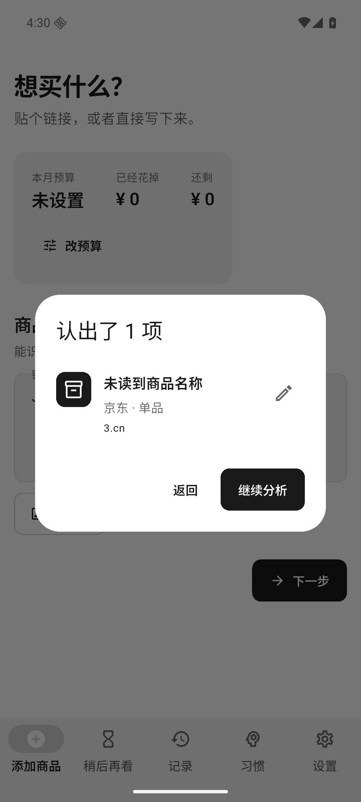

# 购物守护者

购物守护者是一个本地运行的小工具，用来整理购物车和商品分享链接。你可以把淘宝、天猫或京东的分享文字贴进来，也可以直接选择购物车截图。应用会先整理出商品，再交给你自己的模型服务做消费分析。

项目不提供在线账号和中转服务器。商品、设置和记录都留在本机，模型与商品接口的费用由用户自己的 API Key 承担。

> 现在支持 macOS、Android、iOS 和 Windows。macOS、Android、Windows 提供现成安装包；iOS 目前提供源码自签安装。



## 已经能做什么

- 解析京东购物清单分享链接
- 解析京东单商品短链和商品链接
- 解析淘宝、天猫单商品分享链接
- 从淘宝、天猫、京东购物车截图中识别商品
- 在 Android 或 iOS 分享面板中直接把商品文字或链接发给购物守护者
- 使用 JustOneAPI 补充商品标题、价格和图片
- 在导入前预览并核对识别结果
- 配置自己的 OpenAI-compatible 模型并生成结构化购买建议
- 设置月度预算和个人消费规则
- 从本地记录中选择最多 5 条相关经历，让后续分析参考你过去的决定和反馈
- 选择购买、等待、放弃或寻找替代
- 保存本地决策历史、状态时间线、冷静期和购买后反馈
- 反馈可记录使用频率、1–5 分满意度和后悔原因
- 确认购买后默认在 7 天后发送本地反馈提醒
- 给决策添加分类和标签，并在后续分析中作为上下文
- 在“习惯”页查看由真实购买记录生成的个人物品库
- 到期时发送本地通知
- 查看基于真实记录的消费习惯统计
- 导出或清除本地数据，导出内容不含 API Key
- 切换浅色、深色、跟随系统主题
- 切换中文和英文

淘宝购物车分享链接并不总能在淘宝 App 之外打开，所以截图导入是目前最稳妥的办法。京东既支持购物清单链接，也支持截图。

## 安装 macOS 版

1. 打开仓库右侧的 **Releases**。
2. 下载最新的 `shopping-guardian-macos-v*.zip`。
3. 解压后，把“购物守护者”拖到“应用程序”文件夹。
4. 双击打开。

当前安装包还没有 Apple Developer ID 签名和公证。如果 macOS 拦截启动，可以在 Finder 中右键应用，选择“打开”，再确认一次。也可以前往“系统设置 → 隐私与安全性”，在底部允许打开。

## 安装 Android 版

1. 打开仓库右侧的 **Releases**。
2. 下载最新的 `shopping-guardian-android-v*.apk`。
3. 用系统文件管理器打开 APK。
4. 如果系统拦截，只为当前文件管理器允许“安装未知应用”，安装完可以再关闭。

Android 版支持 Android 7.0（API 24）及以上系统。安装包使用项目专用证书签名，GitHub Release 页会附上 SHA-256，可以用来核对下载文件。

## 安装 iOS 版

iOS 版已经支持系统分享、购物车截图 OCR、Keychain 和冷静期通知，但仓库目前没有 Apple 分发证书，因此不能提供通用 IPA。你可以在 Mac 上用自己的 Apple 开发团队签名并安装到 iPhone：

1. 安装 Flutter 3.44 或更新版本、Xcode 和 Ruby `xcodeproj`：

   ```bash
   gem install --user-install xcodeproj
   flutter pub get
   ```

2. 为项目换成自己能注册的 Bundle ID。下面的命令会同时更新主 App、分享扩展、测试 Target 和 App Group：

   ```bash
   IOS_BUNDLE_ID=com.yourname.shoppingguardian \
     ruby tool/configure_ios_signing.rb
   ```

   如需使用已有 App Group，可再传入 `IOS_APP_GROUP=group.com.yourname.shoppingguardian`。

3. 打开 `ios/Runner.xcworkspace`，在 **Runner** 和 **ShareExtension** 两个 Target 的 **Signing & Capabilities** 中选择同一个 Team，并确认两者勾选了相同的 App Group。
4. 用数据线或无线调试连接 iPhone，在手机上启用“开发者模式”，然后在 Xcode 选择这台 iPhone，点击运行。

向其他用户提供 TestFlight、App Store 或注册设备 IPA，需要加入 Apple Developer Program，并由发布者生成对应的证书和描述文件。模拟器构建不能安装到实体 iPhone。

## 安装 Windows 版

1. 打开仓库右侧的 **Releases**。
2. 下载最新的 `shopping-guardian-windows-v*.zip`。
3. 解压整个文件夹，不要只复制其中的 EXE。
4. 双击 `shopping_guardian.exe`。

Windows 首版支持粘贴淘宝/京东分享文字、链接解析、模型分析、预算、规则、历史和本地设置。购物车截图 OCR、从购物 App 直接分享到购物守护者、系统提醒和文件导出暂未接入 Windows；请先使用粘贴文字或手动填写。

## 第一次使用

### 1. 配置 JustOneAPI

进入“设置”，在 JustOneAPI 区域填写自己的 API Key，然后点击“测试并保存”。测试成功后，Key 才会写入本机。



JustOneAPI 用来查询淘宝和京东的商品详情。没有配置 Key 时，京东购物清单仍可以读取页面上已有的标题和价格，但淘宝单商品、京东单商品的详情补全会受到限制。

macOS 版把 Key 保存到当前用户的应用数据目录，并设置为仅当前用户可读。Android 使用 Android Keystore 支持的安全存储，iOS 使用 Keychain，Windows 使用系统安全存储。Key 不会写入项目源码，也不会进入数据导出文件。

### 2. 配置分析模型

在设置页的“模型”区域选择预设，或填写完整的 Chat Completions 接口地址和模型名称，然后点击“测试并保存”。OpenAI、DeepSeek 和 Ollama 预设只帮助填写接口地址，不会限制你继续修改；模型名以服务商后台或本机实际安装的名称为准。

云端服务通常需要 API Key，本机 Ollama 等无鉴权服务可以留空。若服务不支持 `response_format`，关闭“请求 JSON 输出”即可；应用仍会在本地检查返回结构，并在必要时请求模型修复一次。分析请求直接发往你填写的地址，不经过项目方服务器。

### 3. 用分享链接导入

1. 在淘宝、天猫或京东 App 中选择“分享”或“复制链接”。
2. 把完整分享文字粘贴到首页的“链接或描述”。
3. 点击“下一步”。
4. 检查应用识别出的商品标题、价格和数量。
5. 确认无误后继续填写预算和购买理由。

支持一次粘贴多条分享文字。京东购物清单会自动展开成多件商品。



### 4. 用购物车截图导入

1. 在淘宝、天猫或京东购物车中截图。
2. 尽量让商品标题、价格和数量完整出现在画面里。
3. 回到购物守护者，点击“选截图”。
4. 选择 PNG、JPEG 或 HEIC 图片。
5. 在预览页检查识别结果。

macOS 使用系统自带的 Vision OCR，识别过程在本机完成，不要求模型支持图片。长购物车可以分成多张截图导入。截图中如果有失效商品、广告或复杂促销，最好在预览页手动核对。

Android 使用随安装包提供的 ML Kit 中文 OCR 模型，图片通过系统文件选择器按次授权，不申请读取整个相册。识别同样在设备上完成。

iOS 使用 Apple Vision OCR；iOS 14 及以上通过系统照片选择器按次读取图片，iOS 13 回退到文件选择器，也不会申请读取整个相册。

### 5. 从 Android 或 iOS 购物 App 分享

1. 在淘宝、天猫或京东里点击“分享”。
2. 在系统分享面板选择“购物守护者”。
3. 应用会打开“添加商品”，并把分享文字放入输入框。
4. 点击“下一步”，核对商品名称和价格。

### 6. 监测目标价

1. 先在设置中完成 JustOneAPI 配置。
2. 导入一件带有稳定商品 ID 的淘宝或京东单品，并完成分析。
3. 在结果页打开“到目标价时提醒我”，填写你愿意下单的价格，再保存决定。
4. 到“稍后再看”可以暂停、删除或手动检查价格。

应用只保存 JustOneAPI 实际返回的价格，不会生成或猜测价格。第一次使用时没有全网历史曲线，只能展示从你开始监测后的本地记录。应用启动时会检查超过 6 小时未更新的商品；也可以随时手动检查。系统可能限制后台运行，因此当前版本不能承诺在价格变化的瞬间提醒。

### 7. 告诉应用你已经有什么

1. 打开“习惯”页，在“我的物品”右侧点击“添加”。
2. 填写物品名称，并从数码、服饰、家居、兴趣收藏等常用分类中选择一项。
3. 标记它是仍在使用、备用/收藏、已淘汰/转卖、已退货，还是现状不确定。
4. 下次分析同分类商品时，发送前核对页会列出本次准备对照的已有物品。

只有“仍在使用”和“备用/收藏”会被当作当前拥有。模型会被要求说明候选商品是在替代、补充还是重复购买；没有同类物品时不会编造。已有物品保存在本地并进入数据备份，发送模型前可以核对和取消。

## 支持情况

| 能力 | macOS | Android | iOS | Windows |
| --- | --- | --- | --- | --- |
| 粘贴分享文字 / 链接 | 支持 | 支持 | 支持 | 支持 |
| 购物 App 系统分享入口 | — | 支持 | 支持 | — |
| 购物车截图 OCR | 支持 | 支持 | 支持 | — |
| 模型分析、预算和历史 | 支持 | 支持 | 支持 | 支持 |
| 冷静期系统提醒 | 支持 | 支持 | 支持 | — |
| 目标价监测（启动时 / 手动检查） | 支持 | 支持 | 支持 | 支持 |
| 数据导出到文件 | 支持 | 支持 | 支持 | — |

淘宝购物车分享页可能受登录和风控限制；京东购物清单链接可直接展开。淘宝和京东单商品详情补全需要 JustOneAPI。

## 已知限制

- 淘宝购物车分享页可能只允许淘宝 App 打开，无法保证每条链接都能自动解析。
- 截图 OCR 会受字体、图片清晰度和商品排版影响，识别后需要人工确认。
- OpenAI-compatible 服务对请求字段的支持范围并不一致；遇到 JSON mode 相关错误时，可在模型设置中关闭“请求 JSON 输出”。
- macOS 安装包尚未签名和公证。
- iOS 尚无通用 IPA；源码安装需要用户自己的 Apple 签名团队和 App Group。
- Android 暂时只接收文字和链接分享；购物车截图请在应用内点击“选截图”。
- Windows 首版暂无截图 OCR、系统分享入口、通知和文件导出。

## 从源码运行

需要 Flutter 3.44 或更新版本。macOS/iOS 构建需要 Xcode；Android 构建需要 JDK 17 和 Android SDK 36；Windows 构建需要 Windows 10/11 和带“使用 C++ 的桌面开发”工作负载的 Visual Studio。

```bash
flutter pub get
flutter run -d macos
# 或
flutter run -d <android-device-id>
# 或（完成 iOS 签名配置后）
flutter run -d <iphone-device-id>
# 或（在 Windows 上）
flutter run -d windows
```

运行检查：

```bash
dart analyze lib test integration_test tool
flutter test
flutter build macos --release
flutter build apk --release
flutter build ios --simulator
flutter build windows --release
```

Android Debug 包不需要额外配置。构建自己的正式签名包时，复制 `android/key.properties.example` 为 `android/key.properties`，填写自己的 keystore 信息。证书和密码文件已被 Git 忽略，请另行安全备份。

macOS Release 产物位于：

```text
build/macos/Build/Products/Release/购物守护者.app
```

## 项目文档

- [MRD](购物守护者-MRD-v0.2.md)
- [PRD](购物守护者-PRD-v0.1-macOS.md)
- [产品上下文](PRODUCT.md)
- [设计规范](DESIGN.md)
- [v1.3.0 审查与验收报告](docs/AUDIT-2026-07-27.md)
- [开发待办与路线图](docs/ROADMAP.md)
- [推荐、已有物品、历史价格与消费人格设计](docs/RECOMMENDATION-DESIGN.md)
- [分发与签名决策](docs/DISTRIBUTION.md)

## 隐私

- 不需要注册账号
- 不上传购物车截图
- 项目不提供模型或商品接口中转服务，也不会收集遥测数据
- 补全商品资料时，商品链接或 ID 与 JustOneAPI Token 会直接发送到 JustOneAPI
- 模型分析前会展示发送摘要；商品、价格、购买理由、分类标签、预算、命中规则、同类已有物品、最多 5 条相关历史摘要和用户亲自确认的个人规律会直接发送到用户填写的模型服务
- 自动导入失败时会在本地记录脱敏诊断；用户主动导出的诊断只包含平台、失败阶段、错误类别和时间，不包含链接、商品名、分享原文或密钥
- API Key 仅用于对应服务的鉴权请求头，不进入模型正文、业务数据导出或 Git
- Android、iOS 和 Windows 的 API Key 使用系统安全存储；macOS 使用 Application Support 目录下权限为 `0600` 的文件
- 决策、预算和规则存入本机 SQLite 数据库，设置存入本机偏好；数据库与 JSON 导出未额外加密，请保护好设备和备份文件

## 无障碍

- 自动化测试覆盖 200% 字号、桌面键盘焦点、可点击控件标签和 Android 触控尺寸
- 发布前仍需在真实设备上分别使用 TalkBack 与 VoiceOver 走查主要流程；自动化语义检查不能替代真人读屏体验
- 真机设备矩阵、20 个验收步骤、通过标准和记录模板见 [真机无障碍验收](docs/ACCESSIBILITY-ACCEPTANCE.md)

## 更新

设置页可以手动检查 GitHub Releases。应用不会后台轮询、自动下载或自动执行更新；检查结果会展示升级说明和可复制的官方下载链接。

## License

Apache License 2.0
